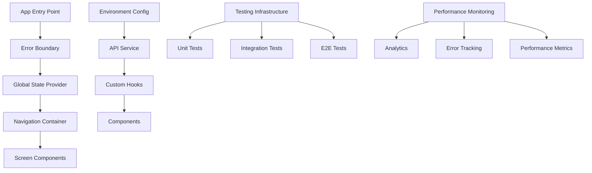

# Design Document

## Overview

This design document outlines the technical approach for implementing comprehensive improvements to the JEWGO React Native application. The improvements are organized into logical phases that can be implemented incrementally while maintaining application stability and user experience.

## Architecture

### High-Level Architecture Changes



### Core Architectural Principles

1. **Separation of Concerns**: Clear boundaries between UI, business logic, and data layers
2. **Dependency Injection**: Configuration and services injected rather than hardcoded
3. **Error Isolation**: Errors contained and handled at appropriate levels
4. **Performance First**: Optimizations built into the architecture from the start
5. **Testability**: All components designed to be easily testable

## Components and Interfaces

### 1. Configuration Management

#### Environment Configuration Service
```typescript
interface EnvironmentConfig {
  apiBaseUrl: string;
  googlePlacesApiKey: string;
  environment: 'development' | 'staging' | 'production';
  enableAnalytics: boolean;
  enablePerformanceMonitoring: boolean;
}

class ConfigService {
  static getConfig(): EnvironmentConfig;
  static isProduction(): boolean;
  static isDevelopment(): boolean;
}
```

#### Implementation Strategy
- Create environment-specific `.env` files
- Use react-native-config for native environment variable access
- Implement configuration validation at startup
- Provide fallback values for missing configurations

### 2. Error Handling System

#### Error Boundary Component
```typescript
interface ErrorBoundaryState {
  hasError: boolean;
  error: Error | null;
  errorInfo: ErrorInfo | null;
}

class GlobalErrorBoundary extends React.Component<Props, ErrorBoundaryState> {
  // Catches JavaScript errors anywhere in child component tree
  // Logs error details for debugging
  // Shows user-friendly error UI
  // Provides retry mechanisms
}
```

#### Error Service
```typescript
interface ErrorService {
  logError(error: Error, context?: string): void;
  reportError(error: Error, metadata?: Record<string, any>): void;
  handleApiError(error: ApiError): UserFriendlyError;
}
```

### 3. Component Refactoring Architecture

#### Large Component Breakdown Strategy

**ListingDetailScreen Refactoring:**
```
ListingDetailScreen (Main Container - <100 lines)
├── ListingHeader (Navigation, title, actions)
├── ListingImageCarousel (Image gallery with indicators)
├── ListingBasicInfo (Title, rating, price, distance)
├── ListingBusinessHours (Hours display and dropdown)
├── ListingContactInfo (Address, contact buttons)
├── ListingFeatures (Tags, special offers)
├── ListingSocialMedia (Social media links)
├── ListingDescription (About section)
└── ListingReviews (Reviews section with modal)
```

#### Component Design Principles
- Single Responsibility: Each component has one clear purpose
- Composition over Inheritance: Use composition for complex UI patterns
- Props Interface: Clear, typed interfaces for all props
- Performance: Memoization where appropriate
- Accessibility: Built-in accessibility support

### 4. State Management System

#### Global State Architecture
```typescript
interface AppState {
  user: UserState;
  favorites: FavoritesState;
  preferences: PreferencesState;
  location: LocationState;
  filters: FiltersState;
}

// Context-based state management
const AppStateContext = React.createContext<AppState>();
const AppDispatchContext = React.createContext<AppDispatch>();
```

#### State Management Strategy
- Use React Context for global state
- Implement useReducer for complex state logic
- Create custom hooks for state access
- Persist critical state to AsyncStorage
- Implement optimistic updates for better UX

### 5. Testing Infrastructure

#### Testing Architecture
```
tests/
├── __mocks__/           # Mock implementations
├── unit/               # Unit tests for hooks, utilities
├── components/         # Component testing
├── integration/        # API and service integration tests
├── e2e/               # End-to-end tests
└── utils/             # Testing utilities and helpers
```

#### Testing Strategy
- **Unit Tests**: All custom hooks, utilities, and pure functions
- **Component Tests**: Render testing, user interaction testing
- **Integration Tests**: API services, data flow testing
- **E2E Tests**: Critical user journeys
- **Visual Regression**: Screenshot testing for UI consistency

### 6. Performance Monitoring System

#### Performance Architecture
```typescript
interface PerformanceMonitor {
  trackScreenLoad(screenName: string, duration: number): void;
  trackUserInteraction(action: string, metadata?: object): void;
  trackApiCall(endpoint: string, duration: number, success: boolean): void;
  trackMemoryUsage(): void;
}
```

#### Monitoring Strategy
- React Native Performance Monitor integration
- Custom performance hooks for screen timing
- Memory usage tracking
- API response time monitoring
- User interaction analytics

## Data Models

### Enhanced API Response Models
```typescript
interface ApiResponse<T> {
  success: boolean;
  data?: T;
  error?: ApiError;
  metadata?: ResponseMetadata;
}

interface ApiError {
  code: string;
  message: string;
  details?: Record<string, any>;
  retryable: boolean;
}

interface ResponseMetadata {
  requestId: string;
  timestamp: string;
  version: string;
}
```

### State Models
```typescript
interface UserPreferences {
  theme: 'light' | 'dark' | 'system';
  language: string;
  notifications: NotificationSettings;
  accessibility: AccessibilitySettings;
}

interface FavoriteItem {
  id: string;
  categoryKey: string;
  addedAt: string;
  syncStatus: 'synced' | 'pending' | 'failed';
}
```

## Error Handling

### Error Handling Strategy

#### 1. Error Classification
- **User Errors**: Invalid input, missing permissions
- **Network Errors**: Connectivity issues, timeouts
- **Server Errors**: API failures, rate limiting
- **Application Errors**: Bugs, unexpected states

#### 2. Error Recovery Mechanisms
- **Automatic Retry**: For transient network errors
- **Manual Retry**: User-initiated retry for failed operations
- **Fallback UI**: Graceful degradation when features fail
- **Offline Mode**: Continue functioning with cached data

#### 3. Error Reporting
- **Development**: Detailed error logs with stack traces
- **Production**: Sanitized error reports with user consent
- **Analytics**: Error frequency and pattern tracking

### Error Boundary Implementation
```typescript
// Global error boundary catches all unhandled errors
// Screen-level error boundaries for isolated error handling
// Component-level error boundaries for critical components
```

## Testing Strategy

### Testing Pyramid Implementation

#### 1. Unit Tests (70% of tests)
- **Custom Hooks**: All business logic hooks
- **Utilities**: Helper functions, calculations
- **Services**: API service methods
- **Reducers**: State management logic

#### 2. Integration Tests (20% of tests)
- **API Integration**: Real API calls with test data
- **Navigation**: Screen transitions and routing
- **State Management**: Global state interactions
- **Location Services**: GPS and location calculations

#### 3. E2E Tests (10% of tests)
- **Critical User Flows**: Search, view details, favorites
- **Cross-Platform**: iOS-specific functionality
- **Performance**: Load time and responsiveness
- **Accessibility**: Screen reader navigation

### Test Infrastructure
```typescript
// Jest configuration with React Native preset
// Testing Library for component testing
// MSW (Mock Service Worker) for API mocking
// Detox for E2E testing on iOS simulator
// Custom testing utilities for common patterns
```

## Performance Optimization

### Performance Strategy

#### 1. Rendering Performance
- **Component Memoization**: React.memo for expensive components
- **Callback Optimization**: useCallback for event handlers
- **Value Memoization**: useMemo for expensive calculations
- **List Optimization**: FlatList with proper keyExtractor and getItemLayout

#### 2. Memory Management
- **Image Optimization**: Proper image sizing and caching
- **Memory Leak Prevention**: Cleanup of listeners and timers
- **State Cleanup**: Remove unused state and subscriptions
- **Bundle Size**: Code splitting and lazy loading

#### 3. Network Performance
- **Request Caching**: Cache API responses appropriately
- **Request Batching**: Combine multiple API calls
- **Offline Support**: Cache critical data locally
- **Image Loading**: Progressive image loading with placeholders

### Performance Monitoring
```typescript
// Performance hooks for measuring component render times
// API response time tracking
// Memory usage monitoring
// Frame rate monitoring for smooth animations
```

## Accessibility Implementation

### Accessibility Strategy

#### 1. Screen Reader Support
- **Semantic Elements**: Proper use of accessibility roles
- **Labels and Hints**: Descriptive labels for all interactive elements
- **Focus Management**: Logical focus order and focus trapping
- **Announcements**: Dynamic content announcements

#### 2. Visual Accessibility
- **Color Contrast**: WCAG 2.1 AA compliance
- **Text Scaling**: Support for dynamic text sizing
- **High Contrast**: Support for high contrast mode
- **Reduced Motion**: Respect user motion preferences

#### 3. Motor Accessibility
- **Touch Targets**: Minimum 44pt touch targets
- **Gesture Alternatives**: Alternative input methods
- **Timeout Extensions**: Configurable timeout periods
- **Error Prevention**: Clear error messages and recovery

### Accessibility Testing
```typescript
// Automated accessibility testing with @testing-library/jest-native
// Manual testing with iOS VoiceOver
// Color contrast validation
// Keyboard navigation testing
```

## Platform-Specific Enhancements

### iOS-Specific Features

#### 1. Native Integration
- **App Icons**: Multiple sizes for different contexts
- **Splash Screens**: Launch screen optimization
- **Status Bar**: Dynamic status bar styling
- **Safe Areas**: Proper safe area handling

#### 2. iOS Features
- **3D Touch**: Quick actions and peek/pop
- **Siri Shortcuts**: Voice command integration
- **Haptic Feedback**: Contextual haptic responses
- **Background App Refresh**: Smart background updates

#### 3. Performance Optimization
- **Launch Time**: Optimize app startup time
- **Memory Usage**: iOS-specific memory management
- **Battery Usage**: Efficient location and network usage
- **App Store Guidelines**: Compliance with Apple guidelines

## Implementation Phases

### Phase 1: Foundation (Weeks 1-2)
1. Fix duplicate App.tsx files
2. Implement environment configuration
3. Set up basic error handling
4. Create testing infrastructure

### Phase 2: Component Refactoring (Weeks 3-4)
1. Break down large components
2. Implement component testing
3. Add performance monitoring
4. Improve TypeScript coverage

### Phase 3: State Management (Weeks 5-6)
1. Implement global state management
2. Add persistence layer
3. Create state-related tests
4. Optimize state updates

### Phase 4: Advanced Features (Weeks 7-8)
1. Enhance accessibility
2. Add iOS-specific features
3. Implement analytics
4. Performance optimization

### Phase 5: Polish and Testing (Weeks 9-10)
1. Comprehensive testing
2. Performance tuning
3. Documentation updates
4. Final quality assurance

Each phase builds upon the previous one, ensuring that the application remains stable and functional throughout the improvement process.